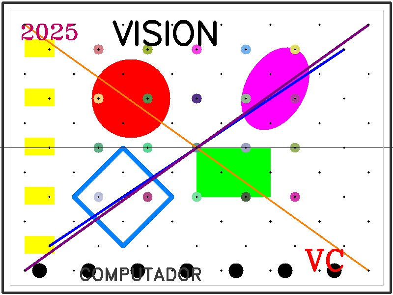
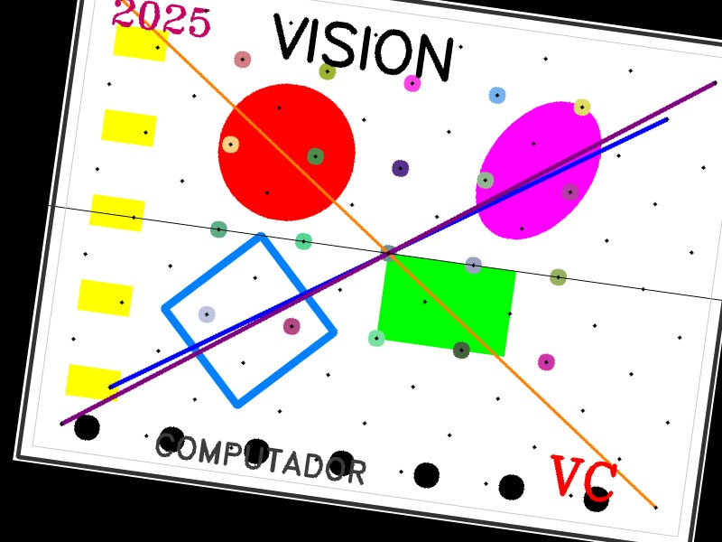
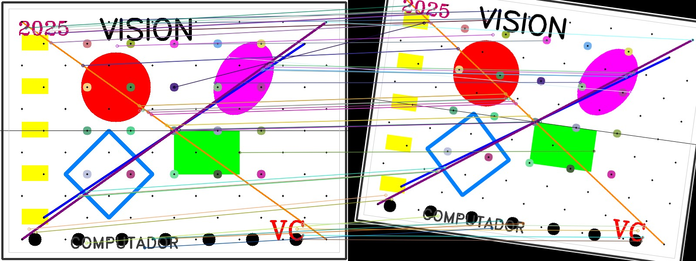
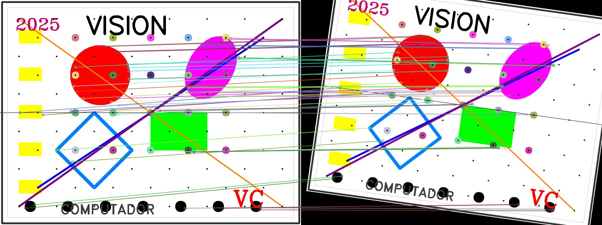
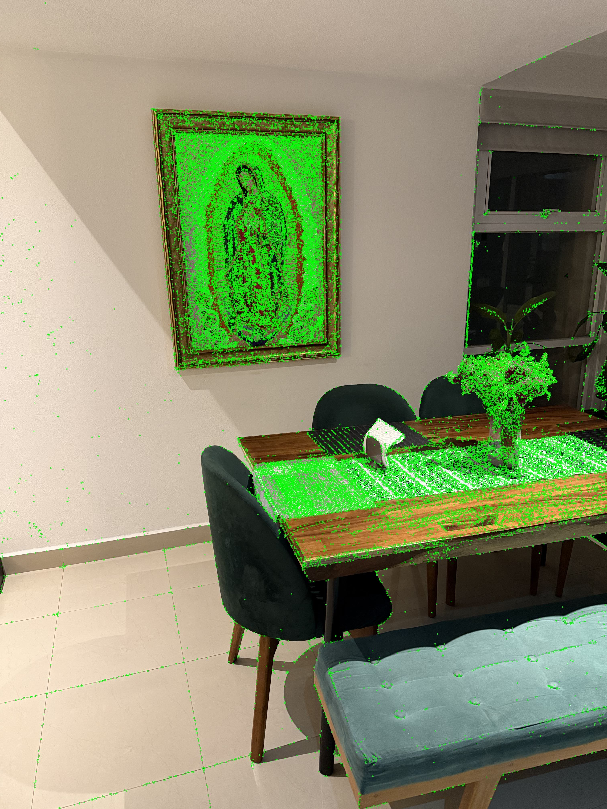
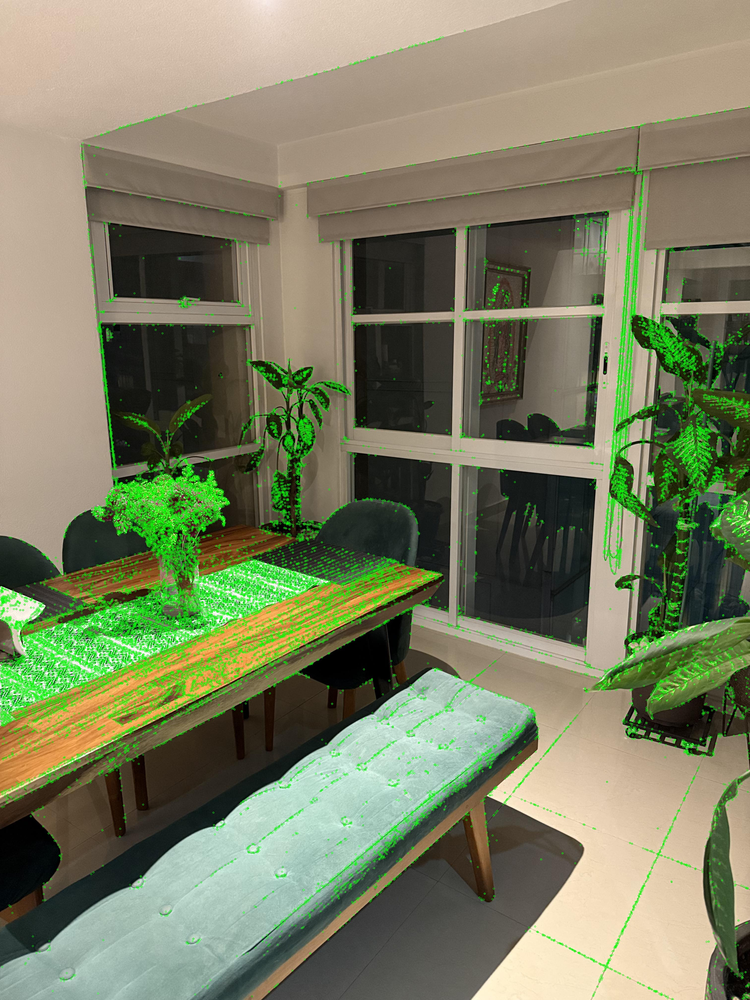
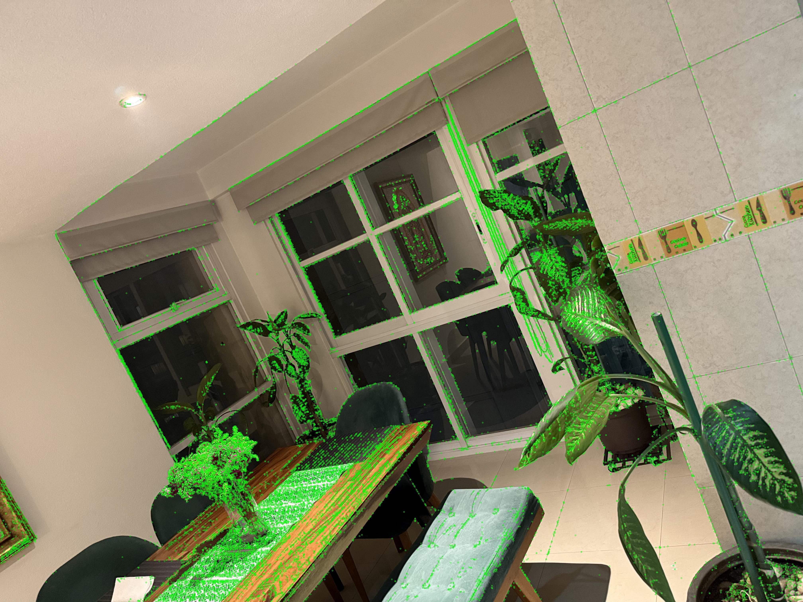
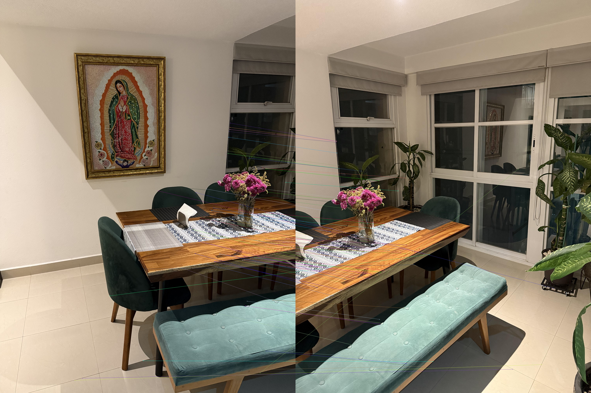
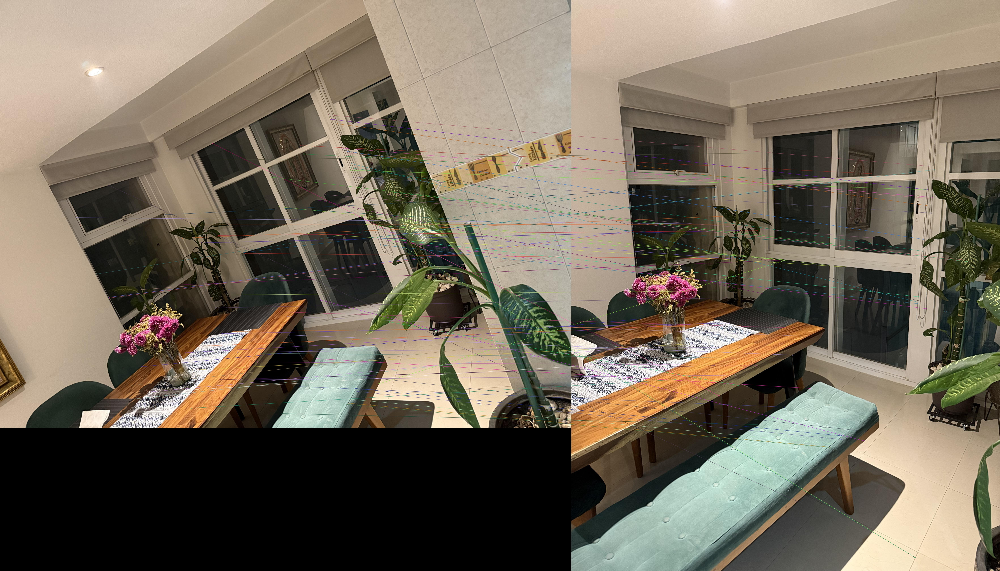

# Taller de Visión por Computador — Informe

Este trabajo es una práctica experimental en visión por computador y procesamiento digital de imágenes. El objetivo general es aplicar, con datos reales, las operaciones fundamentales que permiten a un sistema de visión interpretar una escena: capturar una imagen, corregirla, transformarla y extraer información cuantitativa.

Todas las imágenes usadas fueron tomadas directamente por el equipo con una cámara de teléfono celular, en distintas condiciones de iluminación y contexto. El procesamiento se desarrolló en Python utilizando librerías de código abierto (OpenCV, NumPy y Matplotlib), y se documentó paso a paso.

## Estructura del informe
- [Introducción](#introducción)
- [Marco Teórico](#1-marco-teórico)
- [Metodología](#2-metodología)
- [Experimentos y Resultados](#3-experimentos-y-resultados)
- [Análisis y Discusión](#4-análisis-y-discusión)
- [Conclusiones](#5-conclusiones)
- [Referencias Bibliográficas](#6-referencias-bibliográficas)
- [Análisis de contribución individual](#análisis-de-contribución-individual)

## Introducción

El registro de imágenes es uno de los procesos fundamentales en visión por computador, ya que permite combinar múltiples vistas parciales de una escena para obtener una representación más completa y coherente. Este procedimiento tiene aplicaciones en robótica, fotogrametría, diagnóstico médico y reconstrucción tridimensional, entre otros.

La extracción de características es un proceso esencial en este contexto, pues permite identificar y relacionar puntos distintivos entre diferentes vistas de una misma escena. Este proceso tiene aplicaciones en reconocimiento de objetos, recuperación de imágenes y alineamiento o registro entre vistas. Según Isik (2024), la extracción de características comprende tres etapas principales: detección, descripción y emparejamiento. La detección identifica puntos clave distintivos; la descripción convierte la vecindad de esos puntos en representaciones numéricas invariantes; y el emparejamiento busca correspondencias entre imágenes para permitir su alineación o registro.

En este trabajo se desarrolló un pipeline para registrar y fusionar tres imágenes de un comedor, tomadas desde distintos ángulos. El objetivo fue crear un mosaico panorámico continuo y posteriormente calibrar la escala métrica de la escena para realizar mediciones reales sobre la imagen fusionada.

Además de la implementación práctica, el ejercicio permitió comprender y aplicar los fundamentos teóricos de la detección de características, el emparejamiento robusto mediante RANSAC y las transformaciones geométricas mediante homografías, así como explorar una aplicación directa de la visión computacional en la obtención de medidas reales a partir de imágenes. 

## 1. Marco Teórico

### 1.1. SIFT (Scale-Invariant Feature Transform)
Propuesto por Lowe (2004), puede detectar extremos coincidentes entre varias escenas con diferentes condiciones de ruido,  distorsión o iluminación, a través de Difference-of-Gaussian, la localización precisa de puntos clave, la asignación de orientación para la invarianza a la rotación, y la creación de un descriptor local altamente distintivo.

### 1.2. ORB (Oriented FAST and Rotated BRIEF)
ORB fue desarrollado como una alternativa más eficiente computacionalmente. Rublee, R. et all (2011) explican que ORB combina el detector FAST para una orientación rápida y precisa de los puntos con un descriptor BRIEF orientado para una búsqueda eficiente de vecinos cercanos, proporcionando un método rápido, eficiente para aplicaciones en dispositivos menos robustos o en aplicaciones en tiempo real.

### 1.3. AKAZE (Accelerated KAZE)

### 1.4. RANSAC (Random Sample Consensus)
Desarrollado por Fischler y Bolles (1981), RANSAC permite interpretar o suavizar datos que contienen un porcentaje significativo de errores, como los generados por los detectores de características, así, logra ajustar un modelo incluso con un gran número de datos iniciales con errores. El principio de RANSAC es utilizar el número mínimo de puntos necesarios para definir un modelo y, a partir de ese modelo, verificar si el resto de los datos son compatibles.

## 2. Metodología

En esta sección se describe de manera detallada el pipeline de procesamiento, su justificación técnica y los diagramas de flujo correspondientes por módulo.

### 2.1. Módulo de carga y preprocesado

#### 2.1.1. Descripción del pipeline
Se cargan las tres imágenes (img1, img2, img3) tomadas desde diferentes posiciones del comedor y se convierten a escala de grises para facilitar el análisis de características.

#### 2.1.2. Justificación
La conversión a escala de grises reduce el procesamiento computacional y mejora la estabilidad de los detectores de características, ya que se basan en gradientes de intensidad.

#### 2.1.3. Diagrama del proceso
[Inicio] → [Leer imágenes] → [Convertir a gris] → [Salida: imágenes en escala de grises]

### 2.2. Módulo de detección de Keypoints y cálculo de descriptores

#### 2.2.1. Descripción del pipeline
Se selecciona el tipo de detector (SIFT, ORB, AKAZE) y se aplican las funciones detectAndCompute para obtener los puntos clave y sus descriptores correspondientes.

#### 2.2.2. Justificación
Se requiere probar distintos detectores dadas sus diversas propiedades: SIFT es robusto a escala y rotación, ORB es rápido y eficiente en tiempo real, y AKAZE ofrece un equilibrio entre velocidad y precisión.

#### 2.2.3. Diagrama del proceso
[Entrada: imagen gris] → [Seleccionar detector] → [Detectar keypoints] → [Calcular descriptores]

### 2.3. Módulo de matching de descriptores

#### 2.3.1. Descripción del pipeline
Se utilizan los descriptores obtenidos para emparejar características entre imágenes con un BFMatcher (Brute Force) o FLANN, según el tipo de descriptor. Para SIFT/AKAZE (float) se emplea L2; para ORB (binario) se emplea Hamming. Se filtran con la regla de razón de Lowe (ratio test, típicamente 0.75). A continuación, se calculan las coordenadas de los puntos emparejados y se aplica RANSAC para estimar una homografía robusta que relacione las imágenes y elimine outliers.

#### 2.3.2. Justificación
El test de Lowe reduce los falsos positivos garantizando que los matches sean consistentes y fiables antes de estimar la transformación geométrica. Por su parte, RANSAC es un método iterativo que encuentra el mejor modelo ajustado a los datos válidos, evitando que los emparejamientos erróneos afecten el registro.

#### 2.3.3. Diagrama del proceso
[Entrada: descriptores] → [BF/FLANN knnMatch] → [Filtrar con ratio test] → [Buenos matches] → [RANSAC (findHomography)] → [Homografía H] → [Máscara de inliers]

### 2.4. Módulo de construcción del lienzo panorámico y fusión

#### 2.4.1. Descripción del pipeline
Se calculan las dimensiones del lienzo de salida a partir de las esquinas transformadas de cada imagen y se aplica una traslación para garantizar coordenadas positivas. Cada homografía H_i mapea la imagen i al sistema de referencia de la imagen 0. Luego se proyectan con cv.warpPerspective y se combinan en un mismo plano.

#### 2.4.2. Justificación
La homografía permite transformar las imágenes en un sistema de referencia común, creando un mosaico que conserva las proporciones y relaciones espaciales reales.

#### 2.4.3. Diagrama del proceso
[Entrada: imágenes y homografías] → [Transformar esquinas] → [Trasladar lienzo] → [cv.warpPerspective] → [Feather blending por distancia] → [Combinar imágenes]

### 2.5. Módulo de interfaz de calibración y medición

#### 2.5.1. Descripción del pipeline
Se muestra el mosaico final en una ventana de OpenCV y el usuario selecciona dos puntos para fijar la escala (px/cm) y luego puede medir distancias con nuevos pares de clics. En el notebook base se ofrece, de forma opcional, un ajuste del ancho máximo a 1080 px para visualización; el notebook principal trabaja a resolución nativa. La interacción se implementa con interactive_pick_points y los cálculos con set_scale_by_two_points y measure_distance.

#### 2.5.2. Justificación
Permitir la interacción directa sobre la imagen facilita la calibración basada en objetos de referencia y la medición visual en unidades físicas reales.

#### 2.5.3. Diagrama del proceso
[Mostrar mosaico] → [Clics de calibración] → [Calcular escala] → [Clics de medición] → [Mostrar distancia]

## 3. Experimentos y Resultados

### 3.1 Validación con imágenes sintéticas

Se generaron pares de imágenes artificiales con transformaciones geométricas conocidas (rotación, traslación y escala). 

* Imagen base

* Imagen con 10° de rotación, traslación (20,10) y escala 1.0

* Imagen con 15° de rotación, traslación (-15,5) y escala 1.05

* Imagen con -8° de rotación, traslación (30,-20) y escala 0.95

* Imagen con 25° de rotación, traslación (-10,15) y escala 1.1

* Imagen con -12° de rotación, traslación (15,25) y escala 0.98

El algoritmo fue capaz de recuperar correctamente las transformaciones y hacer los matches correspondientes, a continuación se muestran algunos ejemplos:

* Transformación 3 - SIFT

* Transformación 3 - ORB

* Transformación 3 - AKAZE

Los siguientes errores promedio en RMSE y diferencias angulares para SIFT, ORB y AKAZE fueron obtenidos:

| angle |  tx |  ty | scale | method | matches | inliers | rmse_H | angle_err_deg |
| ----: | --: | --: | ----: | :----: | ------: | ------: | -----: | ------------: |
|    10 |  20 |  10 | 1.000 |   ORB  |    1383 |    1013 |  0.039 |        19.985 |
|    10 |  20 |  10 | 1.000 |  SIFT  |     385 |     337 |  0.026 |        20.000 |
|    10 |  20 |  10 | 1.000 |  AKAZE |     772 |     712 |  0.028 |        19.998 |
|    15 | -15 |   5 | 1.050 |   ORB  |    1042 |     715 |  0.105 |        29.965 |
|    15 | -15 |   5 | 1.050 |  SIFT  |     295 |     250 |  0.032 |        29.995 |
|    15 | -15 |   5 | 1.050 |  AKAZE |     649 |     581 |  0.036 |        29.999 |
|    -8 |  30 | -20 | 0.950 |   ORB  |    1169 |     838 |  0.071 |        16.024 |
|    -8 |  30 | -20 | 0.950 |  SIFT  |     371 |     331 |  0.011 |        15.990 |
|    -8 |  30 | -20 | 0.950 |  AKAZE |     724 |     637 |  0.072 |        15.993 |
|    25 | -10 |  15 | 1.100 |   ORB  |     766 |     441 |  0.574 |        49.877 |
|    25 | -10 |  15 | 1.100 |  SIFT  |     252 |     218 |  0.071 |        50.022 |
|    25 | -10 |  15 | 1.100 |  AKAZE |     518 |     433 |  0.065 |        49.973 |
|   -12 |  15 |  25 | 0.980 |   ORB  |    1239 |     882 |  0.010 |        24.066 |
|   -12 |  15 |  25 | 0.980 |  SIFT  |     389 |     329 |  0.015 |        23.995 |
|   -12 |  15 |  25 | 0.980 |  AKAZE |     740 |     677 |  0.057 |        23.986 |

### 3.2 Visualizaciones del proceso paso a paso

#### 3.2.1 Carga de imágenes

 
 

#### 3.2.2 Detección de keypoints (ejemplo con SIFT)

 
 

#### 3.2.3 Matching de descriptores y filtrado con RANSAC

### 3.3 Imagen final fusionada

El mosaico final obtenido muestra una fusión continua del comedor, con transiciones suaves y una alineación precisa entre las tres vistas. Los bordes fueron corregidos mediante feather blending para reducir artefactos visibles.

### 3.4 Calibración y medición

Se fijó la escala a partir de una referencia medida en la escena (por ejemplo, el ancho de la mesa: 161.1 cm) y se estimaron medidas sobre el mosaico. La fila de validación reporta el error respecto a la referencia seleccionada.

elemento | dist_cm | error_vs_ref_cm |
--- | --- | ---
VALIDACION_MESA | 155.99247397214026 | -5.107526027859734
Largo del banco azul | 167.76843585579888 | 
Altura del lado interno del cuadro | 86.40405414080126 | 
Largo del lado interno de la mesa | 132.46366917336135 | 

## 4. Análisis y Discusión

### 4.1. Comparación entre métodos
SIFT ofreció la mayor precisión en el registro, con errores mínimos y mayor cantidad de coincidencias válidas. AKAZE presentó un balance entre tiempo de ejecución y precisión, mientras que ORB, aunque más rápido, mostró mayor sensibilidad a cambios de iluminación.
* SIFT

* ORB

* AKAZE

### 4.2. Análisis de errores y limitaciones
Los principales errores observados se deben a:
•	Variaciones de iluminación entre las tomas.
•	Distorsión de perspectiva por asumir un plano ideal.
•	Errores en la selección de puntos de calibración.
•	Efecto de “anillado” en las zonas con ventanas debido al blending.
### 4.3. Posibles mejoras

Al realizar mediciones sobre imágenes, es importante considerar que una fotografía representa la proyección de un entorno tridimensional sobre un plano bidimensional. Esta transformación introduce distorsiones geométricas debido a la perspectiva: los objetos más lejanos al punto de vista se proyectan con un tamaño aparente menor, mientras que los más cercanos parecen más grandes. Por esta razón, cuando los objetos se encuentran a diferentes profundidades o con inclinaciones respecto a la cámara, las medidas obtenidas directamente sobre la imagen no reflejan sus dimensiones reales. Esto es un aspecto crítico en aplicaciones de visión por computador que buscan estimar tamaños o distancias a partir de imágenes planas.

En cuanto al proceso de fusión de imágenes mediante diferentes detectores de características (SIFT, ORB y AKAZE), se observó que el desempeño visual del panorama final depende en gran medida de la cantidad y calidad de los puntos detectados y emparejados. Los métodos que lograron un mayor número de coincidencias (como SIFT y AKAZE) generaron panoramas más completos y con una transición más suave entre imágenes, evidenciando una correlación positiva entre la densidad de puntos de correspondencia y la calidad de la fusión. Sin embargo, también se identificaron casos en los que un detector con menos puntos, pero con mayor precisión en su localización, produjo resultados visualmente más estables, lo que sugiere que la precisión de los emparejamientos puede compensar una menor cantidad de ellos.

De acuerdo con Bousaid et al. (2020) al realizar mediciones sobre imágenes, es importante considerar que una fotografía representa la proyección de un entorno tridimensional sobre un plano bidimensional. Esta transformación introduce distorsiones geométricas debido a la perspectiva, las cuales afectan la proporción, tamaño y forma de los objetos, dependiendo de la distancia y orientación de la cámara.

Durante las pruebas, se notó que en regiones con colores o figuras muy similares, los detectores tienden a considerarlas poco representativas, reduciendo la cantidad de puntos clave en estas zonas. Esto provoca efectos como anillado, desvanecimiento o zonas mal alineadas en el panorama final, debido a la falta de correspondencias confiables en esas áreas. Dos ejemplos claro fue en el uso de imágenes sintéticas con patrones de ajedrez, donde la similitud entre cuadros dificultó la identificación de correspondencias únicas, y en la sección de las ventanas en las imágenes del comedor. En este tipo de escenarios, los descriptores no lograron distinguir adecuadamente entre puntos visualmente equivalentes, generando emparejamientos ambiguos y menor precisión global.

## 5. Conclusiones

El pipeline implementado logró fusionar tres vistas del comedor con una precisión aceptable y una calibración métrica válida, confirmando la eficacia de los métodos clásicos de registro en entornos reales.

SIFT resultó el método más robusto, AKAZE equilibró precisión y eficiencia, y ORB demostró su utilidad para escenarios donde la velocidad es prioritaria.
El error promedio en las mediciones métricas fue cercano al 3% (≈3%), lo que sugiere una exactitud geométrica adecuada del sistema propuesto.

En conclusión, los resultados confirman que la calidad de la reconstrucción panorámica no depende únicamente del número de puntos detectados, sino también de su distribución espacial, unicidad y robustez frente a la variación local del entorno. Estos factores son determinantes para obtener una fusión de imágenes precisa y estable dentro del contexto de visión por computador.

## 6. Referencias Bibliográficas

* Lowe, D. G. (2004). Distinctive image features from scale-invariant keypoints. International Journal of Computer Vision, 60(2), 91–110. Recuperado de: https://www.cs.ubc.ca/~lowe/papers/ijcv04.pdf

* Rublee, Ethan & Rabaud, Vincent & Konolige, Kurt & Bradski, Gary. (2011). ORB: an efficient alternative to SIFT or SURF. Proceedings of the IEEE International Conference on Computer Vision. 2564-2571. 10.1109/ICCV.2011.6126544. Recuperado de: https://www.researchgate.net/publication/221111151_ORB_an_efficient_alternative_to_SIFT_or_SURF

* Fischler, M. A., & Bolles, R. C. (1981). Random Sample Consensus: A Paradigm for Model Fitting with Applications to Image Analysis and Automated Cartography. Communications of the ACM, 24(6), 381–395. Recuperado de:  https://dl.acm.org/doi/10.1145/358669.358692

* ISIK M. 2024. Comprehensive empirical evaluation of feature extractors in computer vision. PeerJ Computer Science 10:e2415 https://doi.org/10.7717/peerj-cs.2415

* A. Bousaid, T. Theodoridis, S. Nefti-Meziani and S. Davis, "Perspective Distortion Modeling for Image Measurements," in IEEE Access, vol. 8, pp. 15322-15331, 2020, doi: 10.1109/ACCESS.2020.2966716. Recuperado de: https://ieeexplore.ieee.org/stamp/stamp.jsp?tp=&arnumber=8960275

## Análisis de contribución individual

* Juan José: Desarrollo del notebook base para la validación de imágenes sintéticas, planteamiento de ideas para el análisis de resultados. 

* Alexander: Desarrollo del notebook principal del pipeline, planteamiento de ideas para el análisis de resultados. Construcción del marco teórico.

* Yuricik: Redacción del informe, experimentos y resultados, análisis de resultados y discusión, conclusiones.

* Thomas: Estructuración del repositorio, modularización de funciones, estandarización de notebooks, apoyo en la redacción del informe y carga a GitHub Pages.